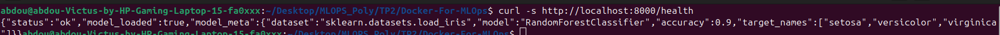
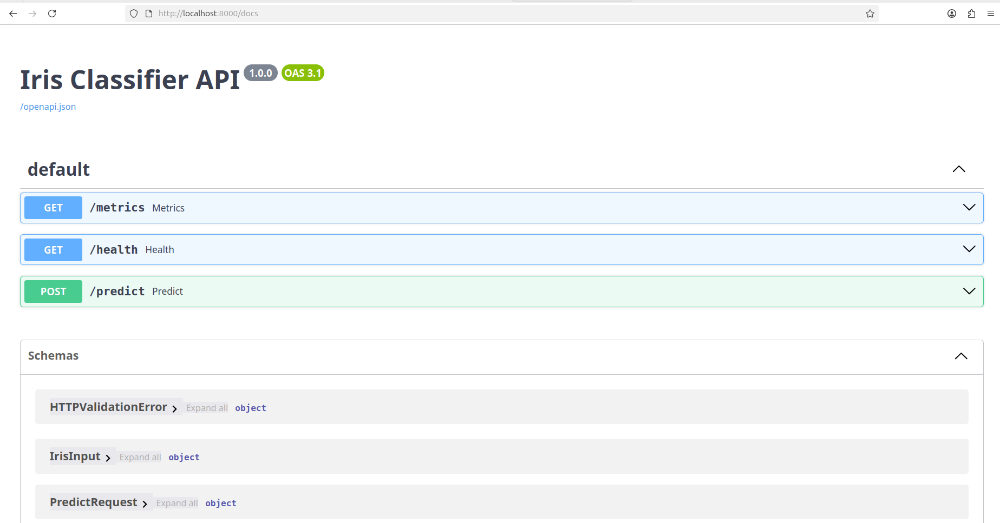
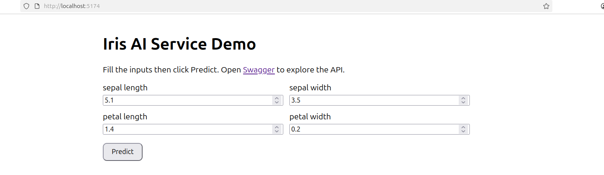
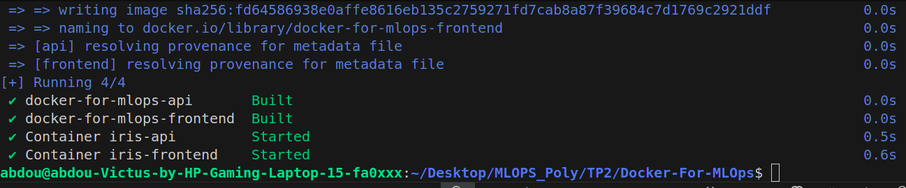
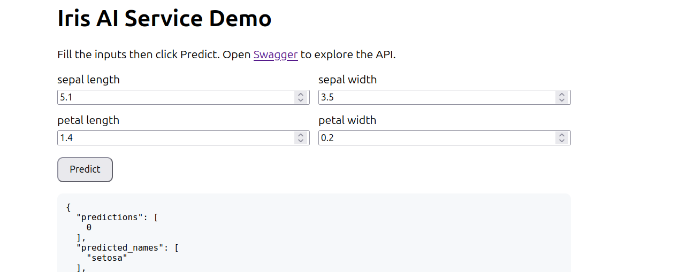
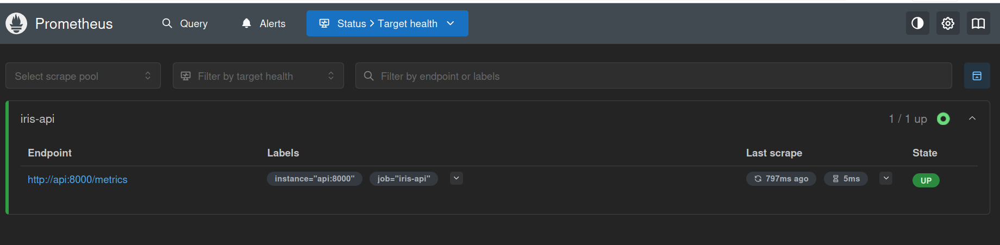
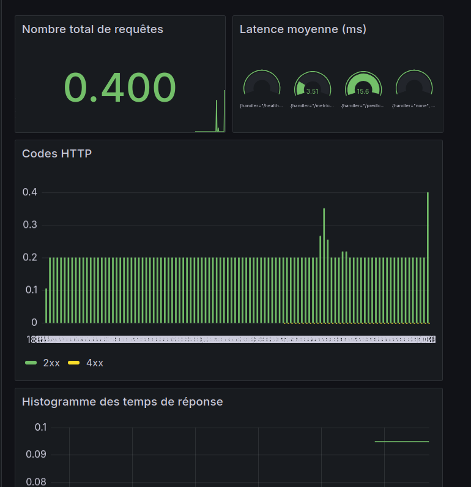

# TP2 : Docker et Docker Compose pour MLOps

Ce document est un compte-rendu du travail réalisé pour le TP2 — création des images Docker pour l'API (FastAPI) et le frontend (Vite/React), et orchestration avec Docker Compose. Il contient les explications des Dockerfiles, les commandes utilisées pour construire et lancer les images, ainsi que des captures d'écran des tests et de l'interface. (Première partie sans Prometheus/Grafana ; la partie monitoring est ajoutée et expliquée ensuite.)

---

## 1) Fichiers Docker créés

- `api/Dockerfile` — image pour l'API Python (FastAPI) basée sur `python:3.11-slim`.
- `frontend/Dockerfile` — build multi-étapes : compilation Node (Vite) puis déploiement via `nginx`.

Les explications détaillées suivent.

## 2) `api/Dockerfile` 


- `FROM python:3.11-slim`
  - Image de base légère avec Python 3.11. `-slim` réduit la taille comparée à l'image complète.

- `ENV PYTHONDONTWRITEBYTECODE=1 \`
  `    PYTHONUNBUFFERED=1 \`
  `    PIP_NO_CACHE_DIR=1`
  - Variables d'environnement pour :
    - empêcher la création de fichiers `.pyc`,
    - forcer le buffering non-bloquant (logs visibles en temps réel),
    - éviter le cache pip pour réduire la taille de l'image.

- `RUN apt-get update && apt-get install -y --no-install-recommends build-essential && rm -rf /var/lib/apt/lists/*`
  - Installe les dépendances système nécessaires au build des paquets Python (par exemple pour des wheels compilés). `--no-install-recommends` et suppression des listes apt réduisent la taille finale.

- `WORKDIR /app`
  - Définit le répertoire de travail dans le conteneur.

- `COPY requirements.txt .`
  - Copie la liste des dépendances pour profiter du caching Docker : si `requirements.txt` ne change pas, la couche `pip install` est réutilisée.

- `RUN pip install --no-cache-dir -r requirements.txt`
  - Installe les dépendances Python sans stocker le cache pip dans l'image.

- `COPY . .`
  - Copie le code de l'application dans l'image.

- `EXPOSE 8000`
  - Indique que l'application écoute sur le port 8000 (informations documentaires, pas d'ouverture de port automatique hors docker run/compose).

- `CMD ["uvicorn", "app.main:app", "--host", "0.0.0.0", "--port", "8000"]`
  - Commande par défaut pour lancer Uvicorn exposant l'application FastAPI.

## 3) `frontend/Dockerfile` 

Ce Dockerfile est multi-étapes : un `builder` pour compiler l'application React/Vite, puis un stage `nginx` qui sert les fichiers compilés.

- `FROM node:20-alpine AS builder`
  - Image légère Node pour builder l'application.

- `ENV NODE_ENV=development`
  - Définit l'environnement du build (ici mis à `development` dans le Dockerfile ; pour production, `production` est recommandé).

- `WORKDIR /app`
  - Répertoire de travail pour le build.

- `COPY package*.json ./` puis `RUN npm install`
  - Copie les fichiers de dépendances et installe. Cette séparation permet d'utiliser le cache Docker pour éviter de réinstaller si seuls les fichiers source changent.

- `COPY . .` puis `RUN npm run build`
  - Copie le code source puis exécute la commande de build (généralement `vite build`), produisant un dossier `dist` (ou `build` selon config).

- `FROM nginx:alpine`
  - Image finale légère qui servira les fichiers statiques.

- `RUN rm -rf /var/cache/apk/* && adduser -D -H -u 1001 frontenduser`
  - Nettoie le cache apk et crée un utilisateur non root pour améliorer la sécurité.

- `COPY nginx.conf /etc/nginx/conf.d/default.conf`
  - Remplace la config nginx par une config custom (contenue dans `frontend/nginx.conf`).

- `COPY --from=builder /app/dist /usr/share/nginx/html`
  - Copie les fichiers compilés depuis la phase de build vers le dossier servi par nginx.

- `EXPOSE 80` et `CMD ["nginx", "-g", "daemon off;"]`
  - Expose le port 80 et lance nginx au premier plan.

## 4) Commandes utilisées pour build et run (images individuelles)

Les commandes suivantes ont été utilisées :

- Construire l'image `api` :

```bash
docker build -t iris-api:dev ./api
```

Explication :
- `docker build` : construit une image à partir d'un Dockerfile.
- `-t iris-api:dev` : tag de l'image (`iris-api` avec le tag `dev`).
- `./api` : contexte de build (le dossier contenant le `Dockerfile`).

- Lancer le conteneur de l'API :

```bash
docker run -d -p 8000:8000 --name iris-api iris-api:dev
```

Explication :
- `docker run` : lance un conteneur.
- `-d` : détaché (en arrière-plan).
- `-p 8000:8000` : mappe le port 8000 du conteneur sur le port 8000 de la machine hôte.
- `--name iris-api` : nom du conteneur.
- `iris-api:dev` : image à lancer.

- Construire l'image `frontend` :

```bash
docker build -t iris-frontend:dev ./frontend
```

- Lancer le conteneur du frontend :

```bash
docker run -d -p 5174:80 --name iris-frontend iris-frontend:dev
```

Explication :
- `-p 5174:80` : on mappe le port 80 du conteneur (nginx) vers 5174 sur la machine hôte.


## 5) Docker Compose 

Fichier : `docker-compose.yml` (présent à la racine). Il orchestre plusieurs services : `api`, `frontend`, (et optionnellement `prometheus` et `grafana`). Avantages :

- Lancer simultanément plusieurs conteneurs avec une seule commande.
- Gestion des réseaux internes (`iris-network`) et des variables d'environnement via `.env`.
- `depends_on` assure un ordre de démarrage simple entre services.

Commande utilisée pour lancer l'ensemble :

```bash
docker compose up -d --build
```

Explication :
- `docker compose up` : crée et démarre les services définis par le `docker-compose.yml`.
- `-d` : détaché (arrière-plan).
- `--build` : force la reconstruction des images avant de démarrer.

La capture `screenshots/4.png` montre le terminal prouvant que la commande a marché.

## 6) Captures (tests & interface)

- Test du endpoint health (`/health` ou équivalent) sur `localhost`.
  

- Documentation FastAPI accessible sur `http://localhost:8000/docs`.
  

- Preuve du build et déploiement du frontend avec nginx (page servie).
  

- Sortie terminal montrant `docker compose up -d --build` (commande exécutée).
  

- Interface de l'application en fonctionnement / prédiction correcte (exemple d'utilisation).
  

## 7) Monitoring — Prometheus & Grafana (concept + intégration)

NB : La première partie du TP a été réalisée sans Prometheus/Grafana. Ci-dessous, j'explique ce que sont ces outils, pourquoi ils sont utiles, et comment les ajouter/configurer.

- Prometheus : système de collecte de métriques en pull. Il scrape (interroge) des endpoints exposant des métriques (format Prometheus) et stocke les séries temporelles.
- Grafana : outil de visualisation. Il se connecte à des sources de données (comme Prometheus) pour afficher dashboards (latence, erreurs, taux de requêtes...).

Pourquoi les ajouter ?
- Obtenir visibilité sur la santé et les performances de l'API (ex : latence, erreurs, RPS).
- Créer des alertes ou suivre des tendances.

Comment les ajouter à `docker-compose.yml` ?

- Ajouter un service `prometheus` (image `prom/prometheus`), monter `monitoring/prometheus.yml` comme config, exposer le port 9090.
- Ajouter un service `grafana` (image `grafana/grafana`), exposer le port 3000, fournir des variables d'environnement pour l'utilisateur admin si souhaité.

> Le dépôt contient un exemple de `docker-compose.yml` avec `prometheus` et `grafana` — et un fichier `monitoring/grafana-fastapi-dashboard.json` pour importer le dashboard.

### 7.1 Configuration manuelle de Grafana

Après démarrage (avec `docker compose up -d --build`), suivre ces étapes pour connecter Grafana à Prometheus et importer le dashboard fourni :

1. Ouvre Grafana : `http://localhost:3000`
   - User: `your user`
   - Password: `your pass`

2. Ajouter la source de données :
   - Type : `Prometheus`
   - Name : `prometheus`
   - URL : `http://prometheus:9090`
   - Cliquer sur `Save & Test`.

3. Importer le dashboard :
   - Menu → Dashboards → Import
   - Cliquer sur `Upload JSON`
   - Sélectionner : `monitoring/grafana-fastapi-dashboard.json`
   - Cliquer `Import`.

### 7.2 Vérifier Prometheus

Ouvre : `http://localhost:9090/targets` — tu dois voir ton job `iris-api` avec l’état `UP` ✅.

Prometheus targets
  

Grafana dashboard affichant métriques
  

---

Compte rendu réalisé dans le cadre du TP2 - Docker et Docker Compose pour MLOps
